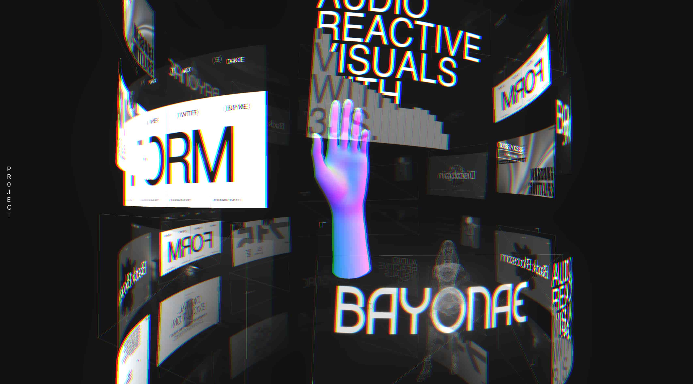

# 3D Cylindrical Carousel – Immersive Three.js Experience



An avant-garde, interactive **3D Cylindrical Carousel** built using **Three.js** and custom **GLSL Shaders**. This project features a central 3D model surrounded by a floating, infinite vertical scroll of image panels that react dynamically to user input, velocity, and mouse movement.

Live Demo: [https://3js-cylindrical-carousel.vercel.app/](https://3js-cylindrical-carousel.vercel.app/)

## Features

* **Cylindrical Geometry:** Images are programmatically bent and positioned along a 3D cylinder for a futuristic "Control Center" vibe.
* **Custom GLSL Shaders:**
    * **Dynamic Distortion:** Vertices wobble based on scroll velocity and simplex noise.
    * **Post-Processing:** Real-time **RGB Shift** and **Unreal Bloom** that intensifies with scroll speed.
    * **Fog & Depth:** Integrated scene fog and distance-based opacity fading for a deep, cinematic look.
* **Smooth Interaction:** Support for Mouse Wheel, Touch Swiping, and Mouse Tracking for perspective shifting.
* **Optimized Performance:** Uses **DRACO compression** for 3D models and `ShaderMaterial` for high-performance GPU rendering.
* **Responsive Design:** Adaptive camera positioning for mobile and desktop screens.


## Tech Stack

| Technology | Purpose |
| :--- | :--- |
| **Three.js** | Core 3D engine and scene management |
| **GLSL** | Custom vertex and fragment shaders for distortion effects |
| **Vite** | Lightning-fast development server and bundling |
| **Post-Processing** | UnrealBloom and RGBShift for the "glitch" aesthetic |
| **Draco Loader** | High-efficiency 3D model (GLTF) compression |

## Core Effects

| View | Feature |
| :--- | :--- |
| **Cylindrical Wrap** | Images curved perfectly around a central radius. |
| **Velocity Glitch** | RGB Shifting and Bloom that react to how fast you scroll. |
| **Interactive Hand** | A central 3D hand model (GLB) that rotates and anchors the scene. |
| **Wireframe Overlays** | Randomly generated ghost frames for added visual complexity. |

## How to Run Locally

1. **Clone the repository:**
   ```bash
   git clone https://github.com/HarshitKumarSahu/3jsCylindricalCarousel
   cd 3jsCylindricalCarousel
   ```
2. **Install dependencies:**
```bash
npm install
```
3. **Run the development server:**
```bash
npm run dev
```
4. **Build for production:**
```bash
npm run build
```

## Project Structure
* main.js: Contains the Three.js scene logic, custom shaders, and animation loop.
* style.css: Basic reset and full-screen canvas styling.
* /public/model/: Store your hand.glb or other 3D assets here.
* /public/projects/: Place the carousel images (1.jpg, 2.jpg, etc.) here.

